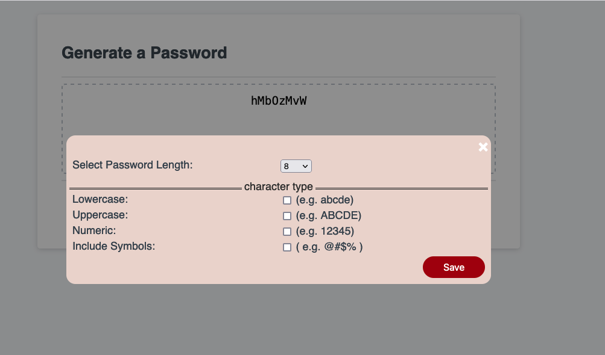
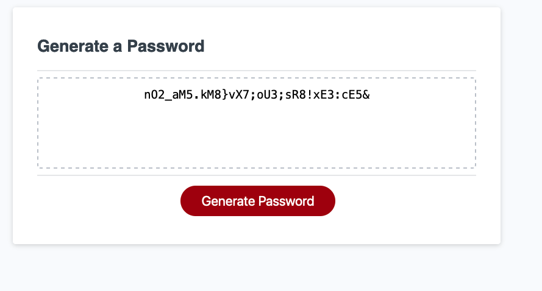

# password-generator

This application was designed as homework assignment to enable a company's employees generate random passwords based on criteria that they have selected. This application runs in a web broswer is and powered by HTML, CSS and JavaScript. It is designed using a mobile-first approach for resposive feel across devices of various screen sizes.

## User Story

AS AN employee with access to sensitive data
I WANT to randomly generate a password that meets certain criteria
SO THAT I can create a strong password that provides greater security

## Acceptance Criteria

GIVEN I need a new, secure password
WHEN I click the button to generate a password
THEN I am presented with a series of prompts for password criteria
WHEN prompted for password criteria
THEN I select which criteria to include in the password
WHEN prompted for the length of the password
THEN I choose a length of at least 8 characters and no more than 128 characters
WHEN asked for character types to include in the password
THEN I confirm whether or not to include lowercase, uppercase, numeric, and/or special characters
WHEN I answer each prompt
THEN my input should be validated and at least one character type should be selected
WHEN all prompts are answered
THEN a password is generated that matches the selected criteria
WHEN the password is generated
THEN the password is either displayed in an alert or written to the page

## Application Screenshots

## Design decisions

While I could have used a basic HTML prompt to complete this assignment, I felt a modal would provide more of a real world solution by allowing me to control the user's selection of password length from a dropdown as opposed to validating after the fact. A modal also allows for a single prompt vs multiple prompts and additional validation. Lastly, it also gives a better look and feel with a whole pallet of CSS options to tap into.
